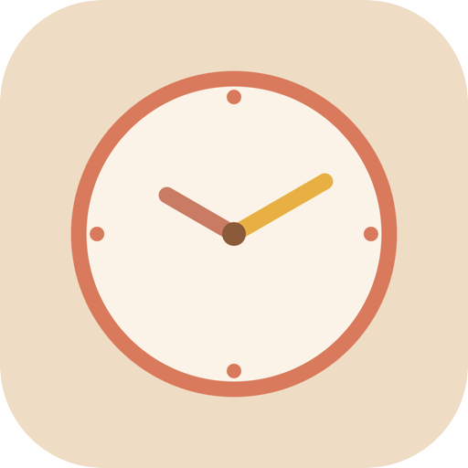
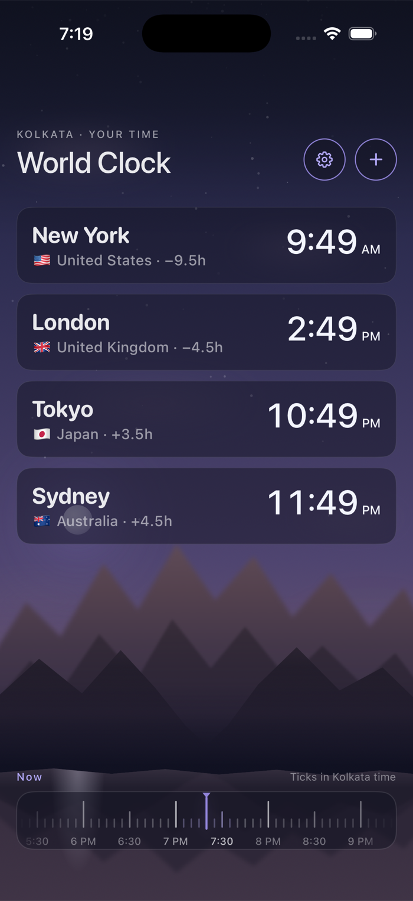
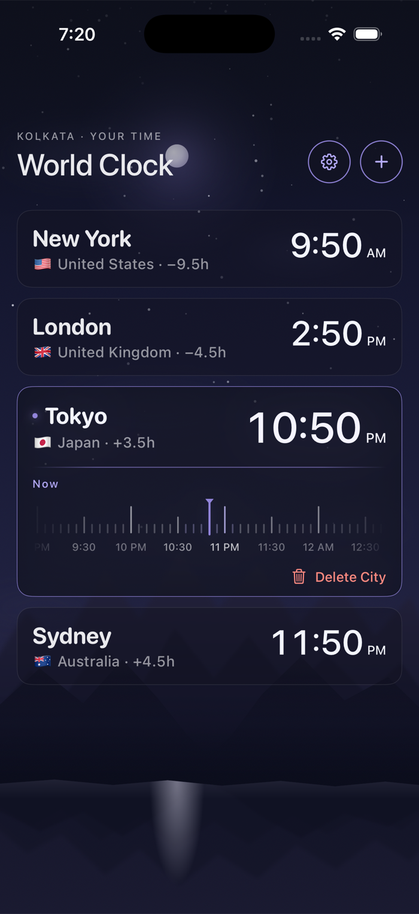
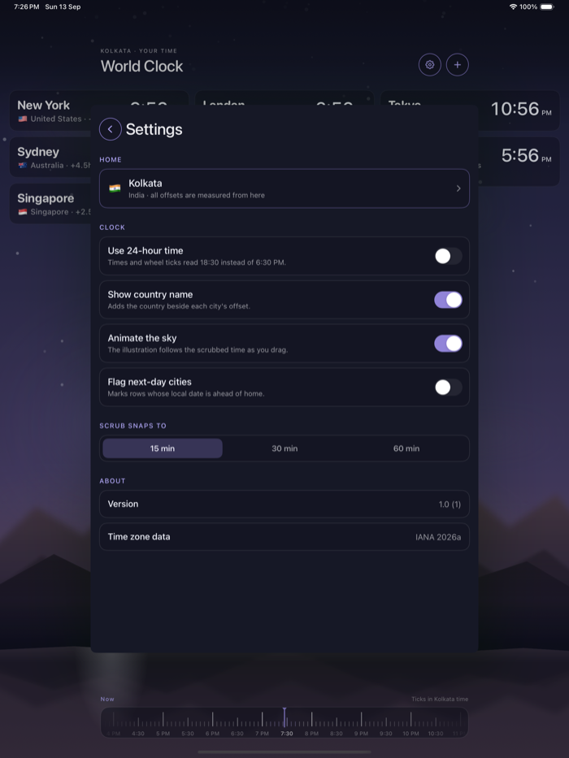
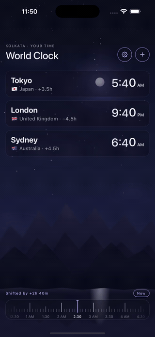
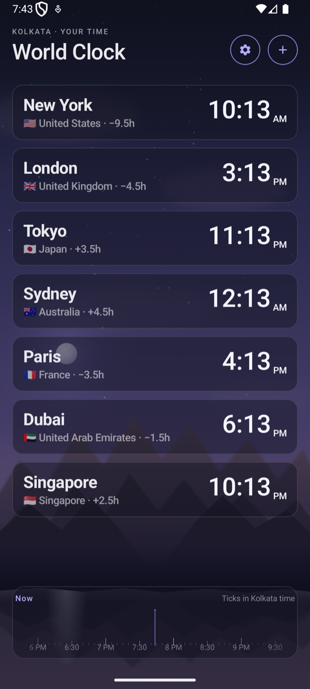
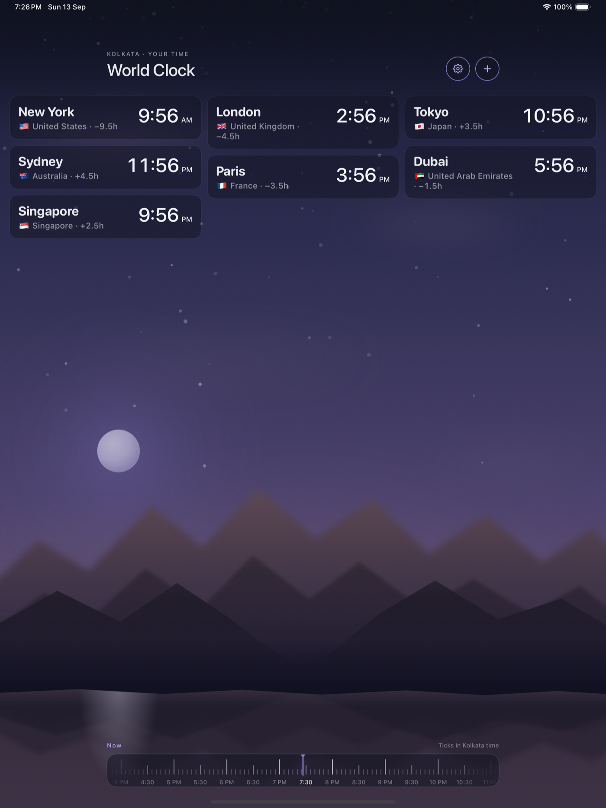
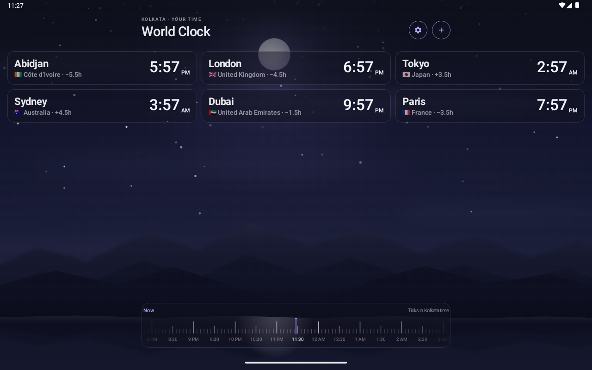
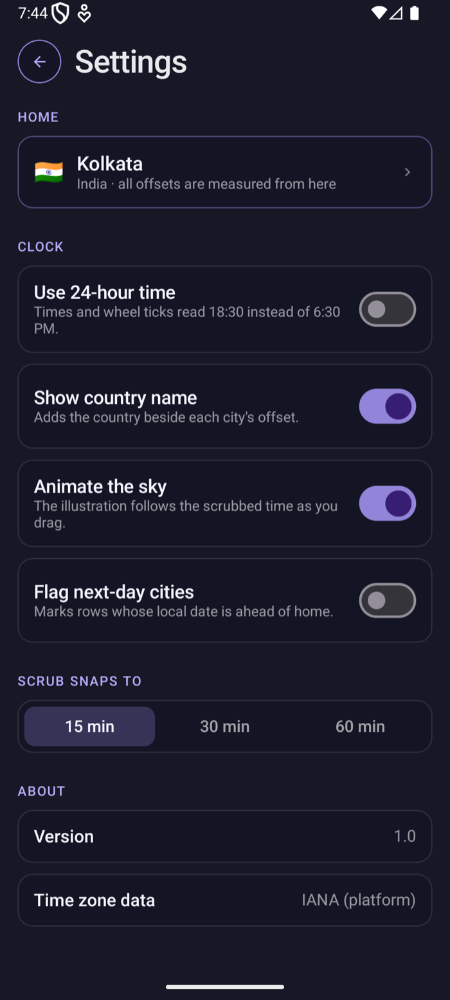

<div align="center">



# WorldClock

**A timezone comparison app that looks like the sky it's telling you about.**

Built natively, twice — SwiftUI for iOS/iPadOS/macOS, Kotlin + Jetpack Compose for Android — sharing one visual language: **Nocturne**.



</div>

---

## What it is

Add the cities you care about. Drag one wheel — the shared bottom bar, or a
city's own inline wheel — and every card updates together, while a
hand-illustrated sky slides through sunrise, day, dusk, and night to match
whichever city (or your own device) is the active anchor.

There's no map, no list of raw UTC offsets to do mental math on. You see the
shift. You see the sky.

| | |
|---|---|
|  |  |
| **Scrub any city on its own terms.** Tap a row and it expands in place with its own wheel — the sky reanchors to that city's local time as you drag. | **Make it yours.** Home city, 12/24-hour time, country labels, next-day flags, and how finely the wheel snaps. |

## The sky

Every screenshot in this README is a live render, not an asset. The
background is a parametric illustration driven by a single number — hour of
day, 0 through 24 — and everything else falls out of that:

- A four-stop gradient sky that keyframes through night → dawn → day → dusk → night
- A sun and moon riding a proper arc (rise → peak → set), each with a
  CSS-accurate soft glow — computed from the actual Gaussian math behind a
  `box-shadow` blur, not an eyeballed approximation
- A deterministic star field that fades in and twinkles once the sun's down
- Drifting clouds tinted warm as the sun climbs
- A mountain silhouette with a mirrored lake reflection and a specular
  highlight that tracks whichever of the sun or moon is dominant

Drag the wheel and the whole scene animates through it in real time — the sky
*is* the time display, not a decoration next to one.

<div align="center">
<br/>
<sub>Dragging the wheel on iPhone — night through sunrise to midday and back, live. (<a href="https://github.com/suraj-shetty/WorldClock/releases/download/media-assets/ios-animation-demo.mp4">Full-quality MP4</a>)</sub>
</div>
<br/>
<div align="center">

</div>

## One layout on phones, a real grid on tablets

Selecting a card grows it in place — but only *that card's* column moves.
Everything else on the board stays exactly where it was.

<div align="center">
<br/>
<sub>iPad — as many ~330pt columns as the width allows</sub>
</div>
<br/>
<div align="center">
<br/>
<sub>Android tablet — the same masonry behavior, via a native <code>LazyVerticalStaggeredGrid</code></sub>
</div>

On a phone, that's just one column — the same layout, doing the same thing,
with nothing to configure differently.

## Two native apps, one design

| | iOS / iPadOS / macOS | Android |
|---|---|---|
| UI | SwiftUI | Jetpack Compose |
| Illustration | `Canvas` | `Canvas` |
| Persistence | SwiftData | SharedPreferences (JSON) |
| Grid | Hand-rolled masonry (`HStack` of independent `VStack` columns) | `LazyVerticalStaggeredGrid` |
| Min OS | iOS/iPadOS 17, macOS 14 | Android 8.0 (API 26) |

Neither app wraps the other, and neither ships a cross-platform UI
framework — the goal was two apps that each feel entirely native to their
platform while looking unmistakably like the same product. Same accent color
(`#9184D9`, used only as a line or a glow — never a fill), same type scale,
same wheel math, same sky.

<div align="center">
<br/>
<sub>The same settings screen (shown on iOS above), native on Android</sub>
</div>

- **[`iOS/`](iOS/)** — the SwiftUI app. See [`iOS/README.md`](iOS/README.md)
  for the file-by-file breakdown and build instructions.
- **[`Android/`](Android/)** — the Compose app. See
  [`Android/README.md`](Android/README.md) for the same.

## Try it

```bash
# iOS / iPadOS / macOS — open in Xcode, or from the command line:
cd iOS
xcodebuild -project WorldClock.xcodeproj -scheme WorldClock_iOS \
  -destination 'platform=iOS Simulator,name=iPhone 17 Pro' test

# Android — open in Android Studio, or from the command line:
cd Android
./gradlew :app:assembleDebug :app:testDebugUnitTest
```

---

<div align="center">
<sub>Visual design: the <strong>Nocturne</strong> system — dark glass cards, one accent color used only as a line or a glow, and a wheel scaled to 1.5pt per minute.</sub>
</div>
